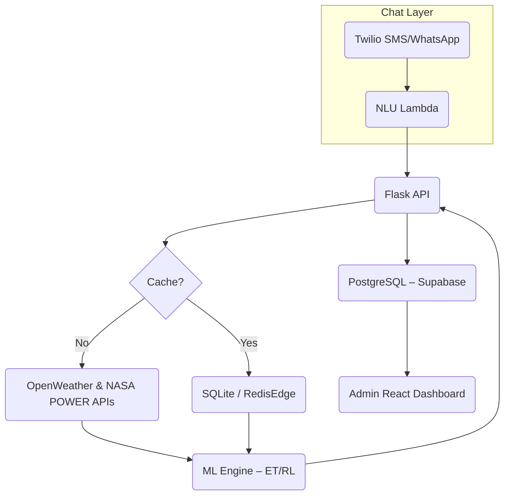

# Project Proposal – HAVK: Hacking the Desert 2025

## Solution Name
**IrrigaBot – AI Irrigation Co-Pilot for Water-Stressed Smallholders**

## 1. Alignment with Hackathon Challenge
* **Scarcity Theme:** Tackles _water scarcity_ and downstream **food insecurity** in arid “desert” regions by optimising every drop used in irrigation.
* **Software-only Deliverable:** Pure SaaS + SMS/WhatsApp bot. Hardware sensors optional; works with manual inputs.
* **Judging Criteria Fit:**
  * **Technical Depth (10):** Combines weather APIs, ML evapotranspiration model, reinforcement-learning schedule optimiser, Twilio-driven chatbot, and offline-first progressive backend.
  * **Creativity (10):** Brings precision-ag insights to feature-phone farmers via local-language conversational UI—no apps, no expensive hardware.
  * **Accessibility (10):** Runs on 2G SMS, WhatsApp, or USSD; multilingual; voice fallback with Twilio TTS.
  * **Usability (5):** 3-step onboarding, daily advisory messages + on-demand Q&A.
  * **Fun Factor (5):** “Moisture Score” leaderboard between villages with badge GIFs (opt-in) and water-saved counters.
  * **Visuals (5):** Admin web dashboard with real-time map of fields, savings heatmap, and demo storyline for judges.

## 2. Problem & Impact
Smallholder farmers in desert or semi-arid zones often **over- or under-irrigate**, wasting scarce water and slashing yields. Existing precision-irrigation platforms require costly IoT hardware or smartphones.

**IrrigaBot** delivers personalised schedules through ubiquitous channels (SMS/WhatsApp). A conservative 20 % water-use reduction across 1 ha saves ~1.5 M L/year—critical for both **food** and **water** scarcity goals.

## 3. Key Features & Innovation
| # | Feature | Why It’s Innovative |
|---|---------|--------------------|
| 1 | Conversational Scheduling (“When should I water today?”) | Context-aware ET<sub>c</sub> calculations distilled into simple advice. |
| 2 | **Offline ML Cache** | Edge-compiled model runs on serverless worker; auto-falls back to seasonal heuristics if API fails. |
| 3 | Sensor-Optional | Reads soil-moisture SMS entries; later integrates BLE penny-sensor packs. |
| 4 | Water-Saved Ledger | Quantifies litres saved; shares anonymised leaderboard to motivate adoption. |
| 5 | Local-Language NLU | Light-weight rule-based parser + pretrained IndicBERT/MBart fine-tuned on agri vocab. |
| 6 | Admin Dashboard | Map of aggregated savings, AI accuracy tracker, exportable datasets for NGOs. |

## 4. User Journey
```mermaid
sequenceDiagram
    participant F as Farmer (feature phone)
    participant B as IrrigaBot (Twilio)
    participant S as Backend API
    F->>B: "JOIN 100x100 field maize"
    B->>S: create profile (crop, area, location)
    S-->>B: ack + today’s recommended litres
    B-->>F: "Start with 400 L at 6 am. We’ll remind you."
    Note over F,B: Daily
    B->>F: "🌤️ Temp 32 °C. Water 380 L tomorrow. Save 5 % vs avg!"
    F->>B: "DONE"
    B->>S: log water applied ; update model
    S-->>B: new moisture score
    B-->>F: "Great! Village rank ↑ to #3"
```

## 5. Technical Architecture

* **Deployment:** Dockerised micro-services on Render (free tier) + Supabase. 
* **Languages:** Python 3.12, FastAPI/Flask, React + Vite for dashboard.
* **ML:** PyTorch Lightning, pre-trained multilingual model fine-tuned; ET<sub>c</sub> computed via FAO-56 Penman-Monteith.

## 6. Project Structure (repo)
```
|─ backend/
|   |─ app.py               # FastAPI entry
|   |─ ml/
|       |─ model.py         # ET & RL modules
|   |─ nlu/
|       |─ intents.yaml
|   |─ tests/
|─ infra/
|   |─ docker-compose.yml
|   |─ supabase.sql
|─ dashboard/
|   |─ src/
|       |─ App.tsx
|─ twilio-functions/
|   |─ handler.py
|─ docs/
|   |─ diagrams/*
|─ README.md
```

## 7. Deliverables
1. **GitHub Repo** – MIT-licensed code & infra scripts.
2. **5-min Video Demo** – scenario: farmer Maria vs. desert drought + live Twilio conversation, dashboard timelapse.
3. **README** – setup in <10 min with free tiers.

## 8. Accessibility & Inclusivity Measures
* SMS fallback (works on $10 Nokia).
* Voice-call IVR (Twilio <-> Polly) for illiterate users.
* Offline heuristics ensure advice even without internet for ≥24 h.
* Open-source translations via Weblate crowdsourcing.

## 9. Future Extensions
* **Sensor Kit:** $5 capacitive probe + ESP32 LoRa to auto-ingest soil data.
* **Marketplace:** Link to micro-irrigation vendors when water-saving milestones reached.
* **Blockchain Credits:** Optional tokenisation of saved water for NGO offset funding.
* **Edge Deployment:** Raspberry-Pi gateway caches model for entire village.

## 10. Timeline (Hackathon Week)
| Day | Milestone |
|-----|-----------|
| 1 | Finalise scope, Twilio SMS echo, set up repo & CI |
| 2 | ET<sub>c</sub> model baseline, API scaffolding |
| 3 | NLU intents + multi-lang templates |
| 4 | Daily schedule algorithm + Redis cache |
| 5 | React dashboard MVP, water-saved calc |
| 6 | Polish UX, accessibility (voice, emojis), video filming |
| 7 | Buffer, testing, README & submission |

---

**IrrigaBot** brings **precision agriculture** to the most resource-constrained farmers, marrying **AI depth** with **simplicity and fun**—exactly the spirit of **HAVK: Hacking the Desert**.