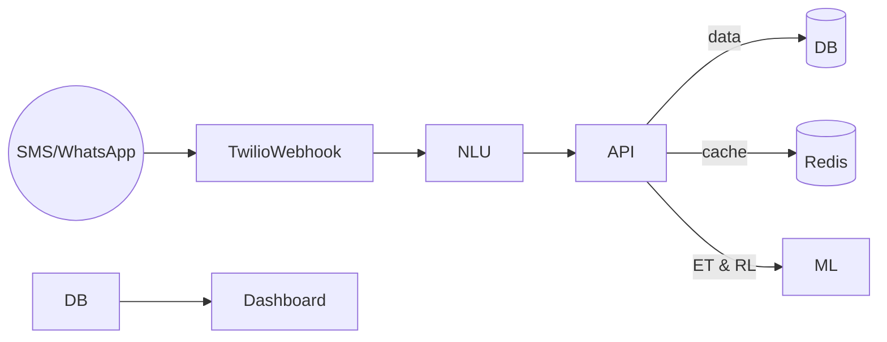

# Architecture Overview – IrrigaBot



*Draft – will evolve as services are implemented.*

## Local Development Stack
Set up via `infra/docker-compose.yml`, launching:
* **api** – placeholder until backend service built.
* **redis** – Edge cache.
* **supabase-db** – Postgres-compatible DB on port 54322.

Run:
```bash
cd infra
docker compose up -d
```