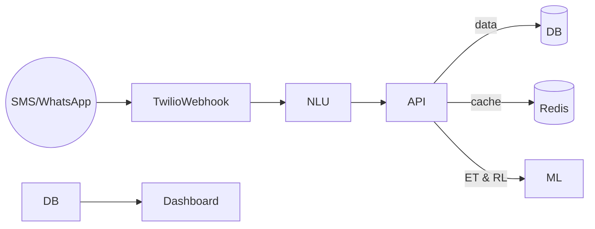

# Architecture Overview – IrrigaBot

```mermaid
flowchart LR
  UserSMS((SMS/WhatsApp)) --> TwilioWebhook
  TwilioWebhook --> NLU
  NLU --> API
  API -- data --> Supabase[(DB)]
  API -- cache --> RedisEdge[(Redis)]
  API -- ET & RL --> ML
  DB --> Dashboard
```

*Draft – will evolve as services are implemented.*