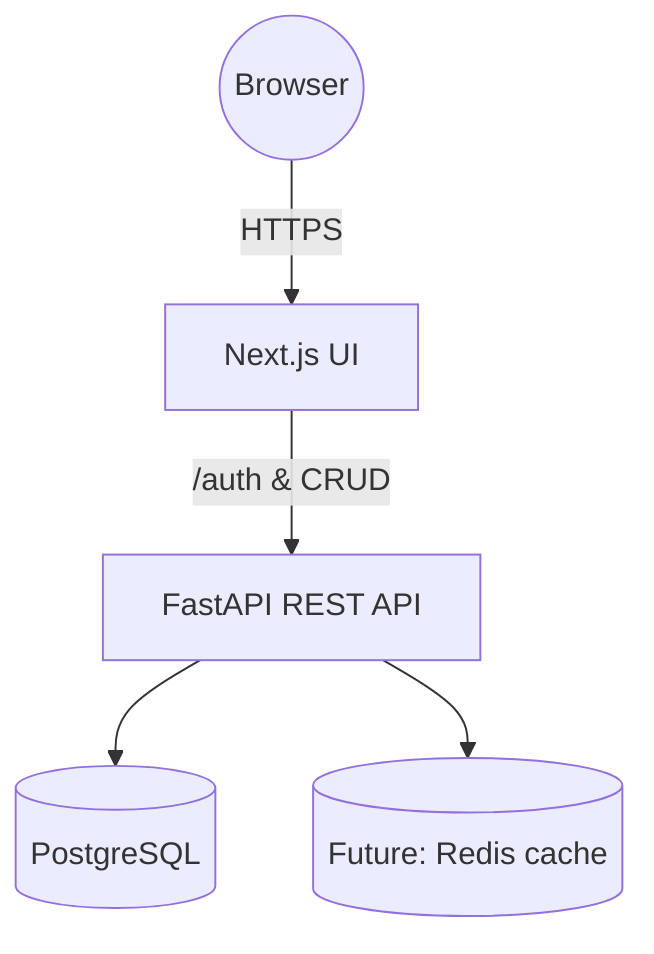

# Technical Documentation

## Overview
The HAVK Scarcity Solution is a full-stack web application built with:
- **Frontend:** Next.js 14 + TypeScript + Tailwind CSS
- **Backend:** FastAPI + SQLModel
- **Database:** PostgreSQL (via Docker Compose)
- **Auth:** JWT bearer tokens, password hashing with Bcrypt

## Architecture Diagram

## API Endpoints
| Method | Path | Auth | Description |
|--------|------|------|-------------|
| GET | `/` | ✗ | Health check |
| POST | `/auth/register` | ✗ | Register new user & obtain token |
| POST | `/auth/token` | ✗ | Exchange credentials for JWT |
| GET | `/resources/` | ✓ | List resources |
| POST | `/resources/` | ✓ | Create resource |
| GET | `/solutions/` | ✓ | List solutions |
| POST | `/solutions/` | ✓ | Create solution |

## Database Models
- **User**(`id`, `email`, `hashed_password`, `is_active`)
- **Resource**(`id`, `name`, `description`, `category`)
- **Solution**(`id`, `title`, `description`, `resource_id`, `creator_id`, `created_at`)

## Security
1. Passwords hashed with Bcrypt (`passlib`)
2. JWTs signed with HS256 (`python-jose`)
3. OAuth2 `password` grant via `/auth/token`
4. Database connections limited to private network (Docker)

## Testing
- **Backend:** `pytest` + `httpx.AsyncClient` (see `production_ready_code/backend/tests/`)
- **Frontend:** Jest + React Testing Library (`__tests__/`)
- Coverage enforced in CI.

## Deployment
Docker Compose provisions `db`, `backend`, and `frontend` services for local development and CI.

For production, backend can be deployed to Fly.io or Render; frontend to Vercel.

## Accessibility & Performance Enhancements
- Semantic HTML and ARIA labels in forms and navigation.
- Tailwind CSS utility classes for responsive design.
- Lazy loading lists (future work) and static asset optimization via Next.js Image component.